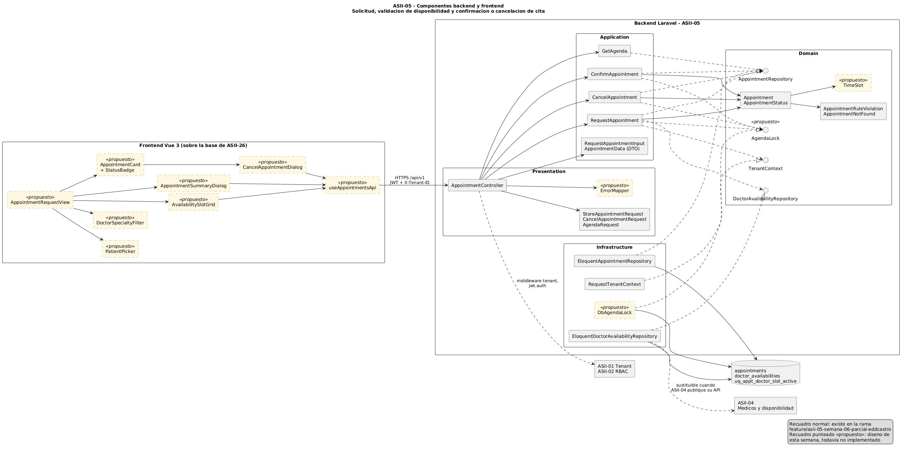

# Semana 7 — Diseño de componentes y refactorización

Módulo **ASII-05 — Citas médicas y agenda**.

| Dato | Información |
|---|---|
| Estudiante | Eddy Adolfo Castro Véliz |
| Código | 1890-23-16857 |
| GitHub | EddCastro |
| Correo | ecastrov5@miumg.edu.gt |
| Rama | `feature/week-07-componentes` |

## Tarea

Diseñar los componentes backend y frontend propios del flujo **solicitud,
validación de disponibilidad y confirmación o cancelación de cita**, y
refactorizar conceptualmente el punto con mayor acoplamiento, separando UI,
aplicación, dominio y persistencia sin ampliar el módulo.

## Resultado principal

El punto de mayor acoplamiento es `AvailabilityRepository::isAvailable()`:
un solo método de persistencia que consulta la jornada del médico (dato de
ASII-04), aplica la regla de cruce en SQL, decide qué estados ocupan agenda y
depende de una transacción abierta por otro para ser seguro ante concurrencia.

El refactor lo divide en una política de dominio (`SlotPolicy` + `TimeSlot`),
dos puertos de lectura (`DoctorScheduleProvider`, `AgendaReader`) y un puerto
de atomicidad (`TransactionRunner` + `AgendaLock`) que el caso de uso invoca de
forma explícita.

## Entregables

| Evidencia pedida | Archivo |
|---|---|
| Diagrama de componentes | [`componentes.png`](componentes.png) — fuente [`componentes.puml`](componentes.puml) |
| Contratos de entrada/salida | [`contratos-entrada-salida.md`](contratos-entrada-salida.md) |
| Comparación antes/después con justificación | [`refactor-antes-despues.md`](refactor-antes-despues.md) |
| Diagrama antes | [`refactor-antes.png`](refactor-antes.png) — fuente `.puml` |
| Diagrama después | [`refactor-despues.png`](refactor-despues.png) — fuente `.puml` |
| Declaración de IA | [`DECLARACION_IA.md`](DECLARACION_IA.md) |



## Componentes

**Frontend (Vue 3):** vista del flujo, selector de paciente, filtro de médico
y especialidad, grilla de horarios, diálogo de resumen, tarjeta de cita con
estado, diálogo de cancelación y el cliente `useAppointmentsApi`.

**Backend (Laravel, cuatro capas):** controladores y FormRequests con un
`ErrorMapper` único; casos de uso `QueryAvailability`, `RequestAppointment`,
`ConfirmAppointment` y `CancelAppointment`; dominio con `Appointment`,
`TimeSlot`, `SlotPolicy` y puertos; adaptadores Eloquent.

## Alcance

Incluye solo el flujo asignado. Reagendamiento, lista de espera y
notificaciones quedan fuera, igual que en las semanas anteriores.

Estos componentes son la base de los wireframes (semana 8), de la evaluación
de usabilidad (semana 9), de la versión móvil (semana 10) y del prototipo
navegable (semana 11).

## Generación de diagramas

```powershell
java -jar plantuml.jar -tpng docs/semana-07-componentes/*.puml
```

## Datos

Todos los datos de ejemplo son ficticios.
