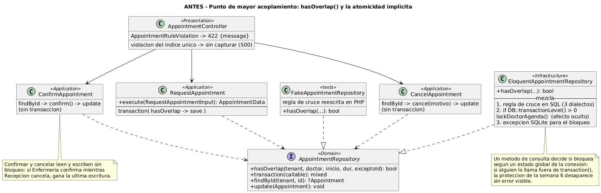
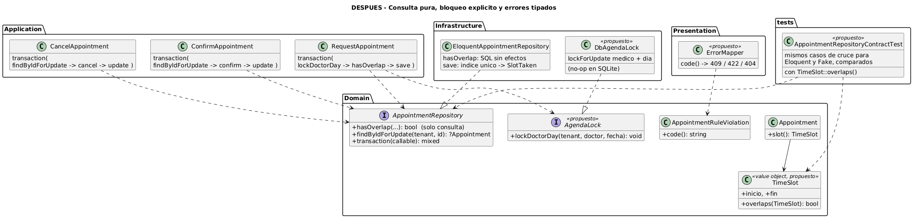

# Refactorización — antes y después

Refactor **conceptual** del punto con mayor acoplamiento del flujo, hecho
sobre el código real de la rama `feature/asii-05-semana-06-parcial-eddcastro`
del repositorio grupal. No agrega funcionalidades: el módulo sigue
solicitando, validando, confirmando y cancelando exactamente lo mismo.

## 1. Cómo se eligió el punto

Se revisó cada componente del flujo y se contó con cuántos de los seis
conceptos de la consigna trabaja a la vez.

| Componente | Citas | Agenda | Disponibilidad | Confirmación | Cancelación | Concurrencia | Total |
|---|:-:|:-:|:-:|:-:|:-:|:-:|:-:|
| `Appointment` (entidad) | ✓ | | | ✓ | ✓ | | 3 |
| `DoctorAvailabilityRepository` | | ✓ | ✓ | | | | 2 |
| `ConfirmAppointment` / `CancelAppointment` | ✓ | | | ✓ | ✓ | ✓ | 4 |
| `AppointmentController` | ✓ | | | ✓ | ✓ | | 3 |
| **`EloquentAppointmentRepository::hasOverlap()`** | **✓** | **✓** | **✓** | **✓** | **✓** | **✓** | **6** |

`hasOverlap()` toca los seis: decide qué citas ocupan la agenda (los estados
que dejan confirmar y cancelar), calcula la disponibilidad por cruce de
intervalos y, desde la semana 6, también aplica el bloqueo de concurrencia.

## 2. Antes



Código real, resumido, de `app/Infrastructure/Modulo05/Repositorios/EloquentAppointmentRepository.php`:

```php
public function hasOverlap(string $tenantId, int $doctorId, DateTimeImmutable $inicio,
                           int $durationMin, ?int $exceptoId = null): bool
{
    $fin = $inicio->modify(sprintf('+%d minutes', $durationMin));

    if (DB::transactionLevel() > 0) {                    // concurrencia oculta
        $this->lockDoctorAgenda($tenantId, $doctorId, $inicio);
    }

    $query = AppointmentModel::query()
        ->where('tenant_id', $tenantId)
        ->where('doctor_id', $doctorId)
        ->whereIn('status', AppointmentStatus::valoresQueBloquean())
        ->where('scheduled_at', '<', $fin->format('Y-m-d H:i:s'))
        ->where($this->expresionDeFin(), '>', $inicio->format('Y-m-d H:i:s')); // SQL por motor
    ...
    return $query->exists();
}
```

Y en `tests/Fakes/Modulo05/FakeAppointmentRepository.php`, la misma regla
escrita otra vez:

```php
if ($cita->scheduledAt() < $fin && $cita->endsAt() > $inicio) {
    return true;
}
```

`ConfirmAppointment` y `CancelAppointment` hacen `findById → confirm()/cancel()
→ update()` sin transacción, y `AppointmentController` convierte toda
`AppointmentRuleViolation` en `422 {"message": ...}`.

### Problemas concretos

| # | Problema | Consecuencia observable |
|---|---|---|
| P1 | Un método de **consulta** aplica un **bloqueo** como efecto secundario | Quien lea `hasOverlap()` en el caso de uso no ve que bloquea filas; separa la regla de la semana 6 de su lugar natural |
| P2 | El bloqueo depende de `DB::transactionLevel() > 0`, un estado global | Si un caso de uso nuevo llama a `hasOverlap()` fuera de `transaction()`, la protección desaparece **sin error ni prueba que falle** |
| P3 | La regla de cruce existe dos veces: SQL (3 dialectos) y PHP en el doble de prueba | Las 19 pruebas de aplicación validan la versión PHP; si el SQL y el doble divergen, esas pruebas siguen aprobando |
| P4 | Confirmar y cancelar leen y escriben sin bloqueo | Si Enfermería confirma mientras Recepción cancela, ambas leen `pendiente` y gana la última escritura: la otra persona cree que su acción quedó registrada |
| P5 | Un solo tipo de excepción, una sola respuesta (422 con texto) | La interfaz no distingue "fuera de jornada" de "horario ocupado" sin leer el mensaje; los códigos y el 409 del contrato de la semana 5 no se emiten |
| P6 | La violación del índice único parcial no se traduce | Si la segunda defensa de la semana 6 se activa, llega al cliente como error de base de datos en vez de "horario ocupado" |

## 3. Después



```php
// Application — RequestAppointment: la atomicidad se ve en el caso de uso
return $this->appointments->transaction(function () use ($appointment, $tenantId, $input, $scheduledAt) {
    $this->lock->lockDoctorDay($tenantId, $input->doctorId, $scheduledAt);   // explícito
    if ($this->appointments->hasOverlap($tenantId, $input->doctorId, $scheduledAt, $input->durationMin)) {
        throw AppointmentRuleViolation::horarioOcupado();                    // code(): APPOINTMENT_SLOT_TAKEN
    }
    $id = $this->appointments->save($appointment);
    return AppointmentData::fromEntity($this->appointments->findById($tenantId, $id) ?? $appointment);
});

// Application — ConfirmAppointment (CancelAppointment es análogo)
return $this->appointments->transaction(function () use ($tenantId, $appointmentId) {
    $appointment = $this->appointments->findByIdForUpdate($tenantId, $appointmentId)
        ?? throw AppointmentNotFound::conId($appointmentId);
    $appointment->confirm();                  // valida la transición con el estado recién leído
    $this->appointments->update($appointment);
    return AppointmentData::fromEntity($appointment);
});

// Domain
final readonly class TimeSlot
{
    public function overlaps(self $otro): bool
    {
        return $this->inicio < $otro->fin && $this->fin > $otro->inicio;
    }
}

// Presentation — ErrorMapper
match ($e->code()) {
    'APPOINTMENT_SLOT_TAKEN'         => 409,
    'APPOINTMENT_NOT_FOUND'          => 404,
    default                          => 422,
};
```

### Qué se separó y hacia dónde

| Responsabilidad | Antes | Después | Capa |
|---|---|---|---|
| Bloqueo por médico y día | Oculto en `hasOverlap()`, condicionado a `transactionLevel()` | `AgendaLock::lockDoctorDay()`, invocado por el caso de uso | Puerto en Domain, adaptador en Infrastructure |
| Consulta de cruce | `hasOverlap()` con efectos | `hasOverlap()` solo consulta; conserva el SQL indexado de la decisión D-14 | Infrastructure |
| Definición de "cruce" | SQL + PHP del doble, por separado | `TimeSlot::overlaps()` como referencia; una prueba de contrato ejecuta los mismos casos contra Eloquent y contra el doble | Domain + pruebas |
| Transición bajo concurrencia | `findById` → `update` sin bloqueo | `findByIdForUpdate` dentro de `transaction()` | Application |
| Tipo de error | Un solo mensaje 422 | `AppointmentRuleViolation::code()` + `ErrorMapper` con los códigos de la semana 5 | Domain + Presentation |
| Violación del índice único | Sin traducir | El adaptador la convierte en `horarioOcupado()` | Infrastructure |

## 4. Justificación

| Problema | Cómo lo resuelve | Principio |
|---|---|---|
| P1 | La consulta ya no tiene efectos; el bloqueo tiene nombre propio | Separación consulta/comando |
| P2 | El caso de uso declara el bloqueo; no depende de un estado global | Dependencias explícitas (DIP, semana 2) |
| P3 | Una sola definición de cruce y una prueba que obliga a ambas implementaciones a coincidir | Una sola fuente de verdad |
| P4 | La transición se valida con el estado recién bloqueado; la segunda persona recibe "ya fue cancelada o confirmada por otra persona" | Consistencia ante concurrencia |
| P5 | El cliente decide por `code`, no por el texto | Contrato explícito (semana 5) |
| P6 | Las dos defensas de la semana 6 producen el mismo resultado para el usuario | Degradación coherente |

## 5. Lo que no cambia

- Estados, transiciones y reglas RN-01 a RN-13 de la entidad.
- La detección de cruces en la base de datos con el índice
  `idx_appt_doctor_date` (decisión D-14 de la semana 6).
- El alcance del bloqueo: un médico y un día (decisión D-29).
- El índice único parcial `uq_appt_doctor_slot_active` (decisión D-30).
- Las cinco rutas de `/api/v1/appointments`.
- El alcance: no se agregan lista de espera ni notificaciones.

## 6. Cómo se verificaría

| Verificación | Criterio |
|---|---|
| Pruebas de concurrencia existentes (6) | Siguen aprobando sin cambios en sus aserciones |
| Nueva prueba: `hasOverlap()` fuera de transacción | No ejecuta ninguna sentencia `FOR UPDATE` (se inspecciona el registro de consultas) |
| Nueva prueba de contrato del repositorio | Los mismos casos (cruce total, parcial, contiguo, cancelada, otro médico, otro tenant) dan el mismo resultado en Eloquent, en el doble y en `TimeSlot::overlaps()` |
| Nueva prueba de transición concurrente | Confirmar y cancelar la misma cita en paralelo produce un éxito y un `APPOINTMENT_INVALID_TRANSITION` |
| Prueba de contrato HTTP | Horario ocupado → 409 `APPOINTMENT_SLOT_TAKEN`; fuera de jornada → 422 `DOCTOR_OUTSIDE_WORKING_HOURS` |
| Suite completa | 148 pruebas aprobadas, igual que en la semana 6 |
