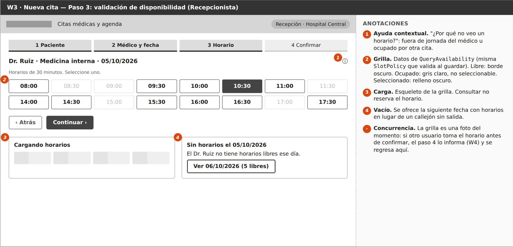

# Semana 8 — Diseño de experiencia de usuario

Módulo **ASII-05 — Citas médicas y agenda**.

| Dato | Información |
|---|---|
| Estudiante | Eddy Adolfo Castro Véliz |
| Código | 1890-23-16857 |
| GitHub | EddCastro |
| Correo | ecastrov5@miumg.edu.gt |
| Rama | `feature/week-08-ux` |

## Tarea

Diseñar el flujo UX de **solicitud, validación de disponibilidad y
confirmación o cancelación de cita** por sus roles autorizados, con inicio,
decisión, confirmación, estados vacío/carga/éxito, errores recuperables, ayuda
contextual y protección de datos.

## Entregables

| Evidencia pedida | Archivo |
|---|---|
| User flow — Recepcionista (y Admin) | [`user-flow-recepcionista.png`](user-flow-recepcionista.png) |
| User flow — Enfermera | [`user-flow-enfermera.png`](user-flow-enfermera.png) |
| User flow — Cancelación y Médico | [`user-flow-cancelacion-medico.png`](user-flow-cancelacion-medico.png) |
| 6 wireframes anotados | [`wireframes/`](wireframes) — fuente editable `wireframes.html` |
| Estados, mensajes, validaciones y reglas de interacción | [`reglas-interaccion.md`](reglas-interaccion.md) |
| Declaración de IA | [`DECLARACION_IA.md`](DECLARACION_IA.md) |

## Wireframes

| # | Pantalla | Estados y reglas anotadas |
|---|---|---|
| W1 | [Agenda del día](wireframes/W1-agenda-del-dia.png) | Inicio por rol, filtros, carga, vacío, minimización de datos |
| W2 | [Paciente, médico y fecha](wireframes/W2-paciente-medico-fecha.png) | Pasos, búsqueda, validación preventiva, paciente no encontrado |
| W3 | [Validación de disponibilidad](wireframes/W3-disponibilidad.png) | Grilla libre/ocupado, carga, vacío con alternativa, ayuda contextual |
| W4 | [Resumen y confirmación](wireframes/W4-resumen-error-409.png) | Validación en línea, envío único, error 409 por concurrencia |
| W5 | [Éxito](wireframes/W5-exito.png) | Código de cita, resultado visible, siguiente paso |
| W6 | [Detalle, confirmar y cancelar](wireframes/W6-detalle-cancelar.png) | Acciones por rol, confirmación destructiva, motivo obligatorio |



## Relación con la semana 7

Cada pantalla usa los componentes definidos la semana anterior:
`AvailabilitySlotGrid` en W3, `AppointmentSummaryDialog` en W4,
`CancelAppointmentDialog` en W6. Los mensajes dependen de los códigos que
emite el `ErrorMapper`.

## Nota para la semana 9

Estos wireframes son la **primera versión**. La semana 9 los evalúa con
heurísticas y WCAG, y las correcciones priorizadas se aplican en las semanas
10 y 11.

## Regenerar las imágenes

```powershell
java -jar plantuml.jar -tpng docs/semana-08-ux/*.puml
```

Los PNG de `wireframes/` son capturas de `wireframes.html` (un `<section>`
por pantalla).

## Datos

Nombres, expedientes y códigos de cita son ficticios.
