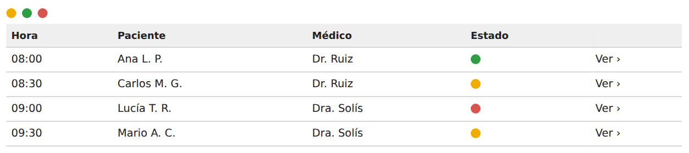
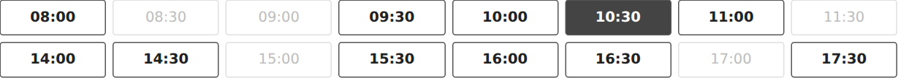
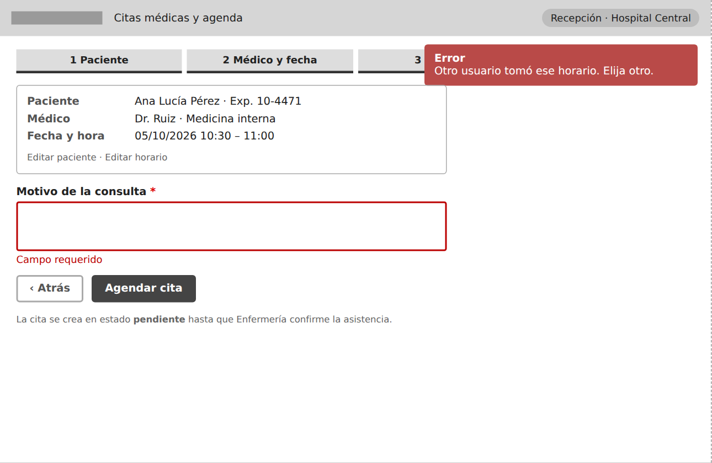
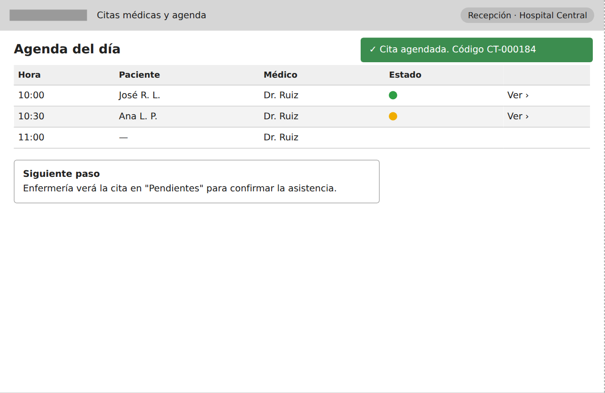
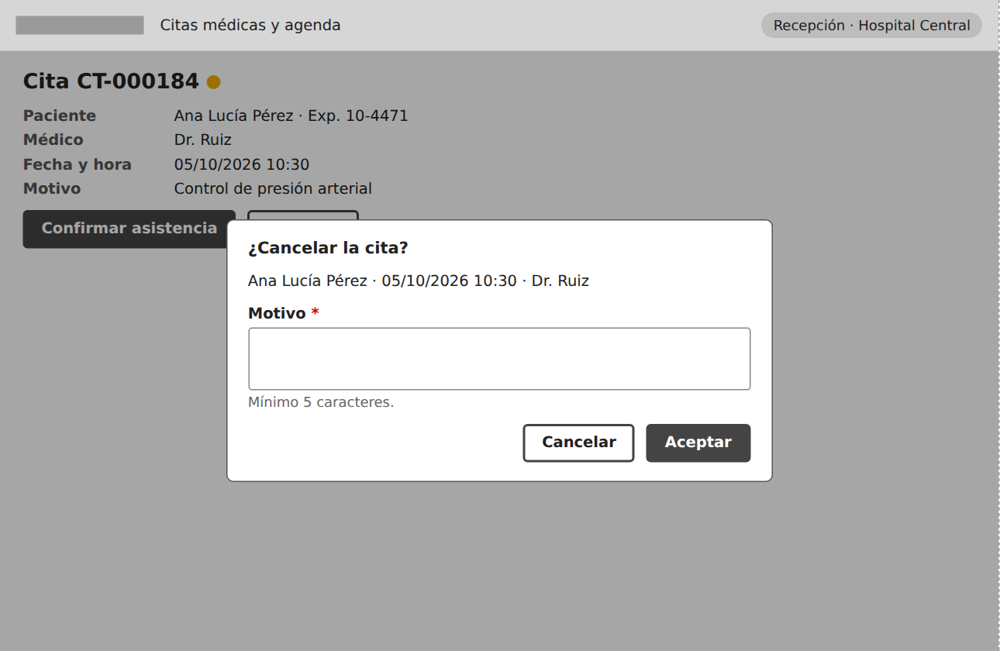
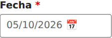
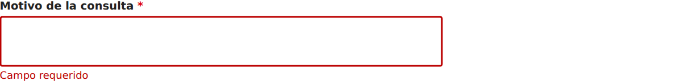

# Hallazgos con evidencia — Semana 9

Cada hallazgo indica pantalla, evidencia, criterio incumplido, severidad y el
concepto del módulo que afecta (citas, agenda médica, disponibilidad,
confirmación, cancelación o concurrencia).

---

## H-01 · El estado de la cita se comunica solo con color

| Pantalla | W1, W5, W6 | Severidad | **4** |
|---|---|---|---|
| Criterios | WCAG 1.4.1, 1.4.11 · Nielsen 6 | Afecta | Agenda, confirmación, cancelación |

La leyenda y la columna Estado usan puntos amarillo, verde y rojo sin texto.
Una persona con daltonismo rojo-verde no distingue "confirmada" de
"cancelada", y un lector de pantalla no anuncia nada. El punto amarillo mide
**1.97:1** contra el fondo (mínimo 3:1).

**Riesgo:** la Enfermera llama a un paciente cuya cita ya fue cancelada, o la
Recepción asume confirmada una cita pendiente.

---

## H-02 · Horarios ocupados casi invisibles

| Pantalla | W3 | Severidad | **3** |
|---|---|---|---|
| Criterios | WCAG 1.4.3, 1.4.11 | Afecta | Disponibilidad |

Texto `#bdbdbd` sobre blanco: **1.88:1** (mínimo 4.5:1). Borde `#e0e0e0`:
**1.32:1** (mínimo 3:1). Con poca luz o brillo bajo, un horario ocupado se
confunde con un hueco en la grilla y el usuario no entiende por qué la agenda
"salta" de 08:00 a 09:30.

---

## H-03 · La grilla de horarios no se puede operar con teclado

| Pantalla | W3 | Severidad | **4** |
|---|---|---|---|
| Criterios | WCAG 2.1.1, 2.4.3, 2.4.7, 4.1.2 · Nielsen 7 | Afecta | Disponibilidad, citas |

Medición automatizada ([teclado.md](evidencia/teclado.md)): **0 de 16**
horarios alcanzables con Tab y **0** elementos con rol. El wireframe no define
cómo se elige un horario sin ratón ni cómo se ve el foco. Si se implementara
como 32 botones sueltos, habría 32 paradas de Tab por día consultado.

**Riesgo:** paso obligatorio del flujo inaccesible; la cita no puede crearse
sin ratón.

---

## H-04 · El conflicto de concurrencia (409) se informa con un aviso genérico y lejano

| Pantalla | W4 | Severidad | **4** |
|---|---|---|---|
| Criterios | WCAG 3.3.1, 4.1.3, 2.4.11 · Nielsen 9 | Afecta | **Concurrencia**, disponibilidad |

El título dice solo "Error". El aviso aparece en la esquina superior derecha,
lejos del botón pulsado, tapa parte del indicador de pasos y no mueve el foco.
Tampoco está definido que un lector de pantalla lo anuncie. El usuario puede no
verlo y volver a pulsar "Agendar cita" sobre un horario que ya no existe.

---

## H-05 · El éxito desaparece a los 5 segundos junto con el código de la cita

| Pantalla | W5 | Severidad | **3** |
|---|---|---|---|
| Criterios | WCAG 2.2.1, 4.1.3, 1.4.3 · Nielsen 1 | Afecta | Citas, confirmación |

El código `CT-000184` solo vive en un aviso temporal. Si el recepcionista está
hablando con el paciente, lo pierde. Además, texto blanco sobre `#3c8d4f`
mide **4.11:1** (mínimo 4.5:1).

---

## H-06 · "Cancelar" significa dos cosas opuestas en la misma pantalla

| Pantalla | W6 (también W2) | Severidad | **4** |
|---|---|---|---|
| Criterios | WCAG 2.4.6, 3.3.4 · Nielsen 4, 5 | Afecta | **Cancelación** |

El botón "Cancelar" de la ficha abre el diálogo; dentro del diálogo,
"Cancelar" **cierra sin cancelar** y "Aceptar" **cancela la cita**. Es una
acción destructiva: quien quiere cancelar la cita pulsa "Cancelar" y no pasa
nada; quien quiere salir pulsa "Aceptar" y la cancela.

---

## H-07 · Fecha numérica ambigua y sin día de la semana

| Pantalla | W1–W6 | Severidad | **2** |
|---|---|---|---|
| Criterios | WCAG 3.3.2 · Nielsen 2 | Afecta | Agenda, confirmación telefónica |

`05/10/2026` se lee 5 de octubre o 10 de mayo según la costumbre del lector.
Al confirmar por teléfono, la Enfermera suele decir el día de la semana, que
la pantalla no muestra.

---

## H-08 · Obligatorio marcado solo con asterisco rojo y error genérico

| Pantalla | W2, W4, W6 | Severidad | **2** |
|---|---|---|---|
| Criterios | WCAG 1.3.1, 3.3.2, 3.3.3 · Nielsen 9 | Afecta | Citas, cancelación |

El asterisco no se explica en ninguna parte y depende del color. "Campo
requerido" no dice qué campo ni cuántos caracteres se esperan, y no está
especificado que el mensaje quede asociado al campo (`aria-describedby`).

---

## H-09 · El diálogo de cancelación no define comportamiento de foco

| Pantalla | W6 | Severidad | **3** |
|---|---|---|---|
| Criterios | WCAG 2.1.2, 2.4.3 | Afecta | Cancelación |

Evidencia: misma captura que H-06. El wireframe no indica dónde queda el foco
al abrir, si Tab puede salir del diálogo hacia la ficha que está detrás, qué
hace Escape ni a dónde vuelve el foco al cerrar.

---

## H-10 · La ayuda contextual depende de un ícono sin nombre

| Pantalla | W3 | Severidad | **2** |
|---|---|---|---|
| Criterios | WCAG 1.1.1, 1.4.13 · Nielsen 10 | Afecta | Disponibilidad |

"ⓘ" no tiene nombre accesible y la explicación de por qué falta un horario solo
aparecería al pasar el ratón.

---

## H-11 · Bordes de botones secundarios con contraste insuficiente

| Pantalla | W2, W3, W4 | Severidad | **1** |
|---|---|---|---|
| Criterios | WCAG 1.4.11 | Afecta | Navegación del flujo |

Borde `#aaaaaa` sobre blanco: **2.32:1** (mínimo 3:1). Afecta a "Atrás" y
"Cancelar" del asistente ([contrastes.md](evidencia/contrastes.md)).
