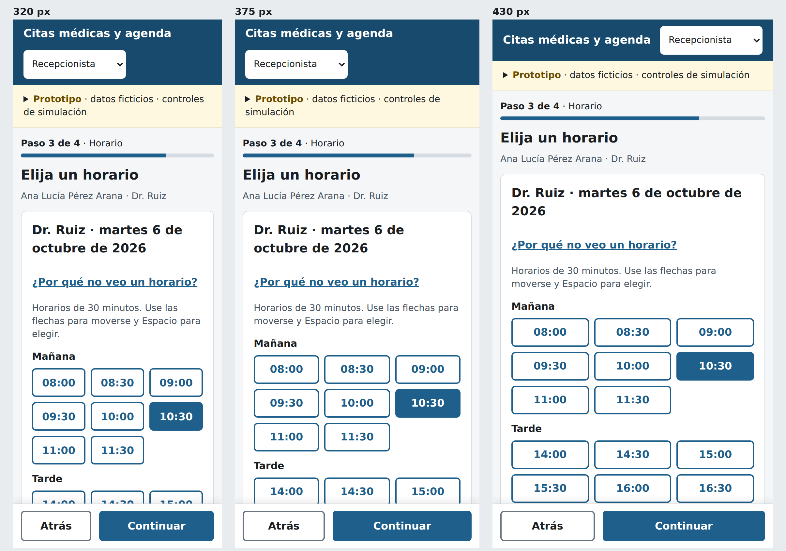

# Semana 10 — Diseño para movilidad

Módulo **ASII-05 — Citas médicas y agenda**.

| Dato | Información |
|---|---|
| Estudiante | Eddy Adolfo Castro Véliz |
| Código | 1890-23-16857 |
| GitHub | EddCastro |
| Correo | ecastrov5@miumg.edu.gt |
| Issue | #5 |
| Rama | `feature/week-10-movil` |

## Tarea

Adaptar **solicitud, validación de disponibilidad y confirmación o
cancelación de cita** a móvil (320–430 px): jerarquizar datos y acciones,
reducir carga cognitiva y definir navegación, tablas y formularios,
confirmaciones y recuperación ante conexión limitada.

## Entregables

| Evidencia pedida | Archivo |
|---|---|
| Propuesta responsive de 3–5 pantallas | [`propuesta-responsive.md`](propuesta-responsive.md) — **5 pantallas** en [`pantallas/`](pantallas), cada una a 320, 375 y 430 px |
| Reglas de breakpoint | [`breakpoints.md`](breakpoints.md) |
| Dos escenarios móviles con decisiones de contenido y error | [`escenarios-moviles.md`](escenarios-moviles.md) |
| Fuente de las pantallas | [`prototipo/index.html`](../../prototipo/index.html) |
| Guía de defensa oral | [`GUIA_DEFENSA_ORAL.md`](GUIA_DEFENSA_ORAL.md) |
| Declaración de IA | [`DECLARACION_IA.md`](DECLARACION_IA.md) |

## Pantallas

| # | Pantalla | Decisión móvil principal |
|---|---|---|
| P1 | [Agenda](pantallas/P1-agenda.png) | Tabla → tarjetas; estado con texto |
| P2 | [Médico y fecha](pantallas/P2-medico-fecha.png) | Una columna; fecha también en letras |
| P3 | [Disponibilidad](pantallas/P3-disponibilidad.png) | Grilla de 3 columnas, Mañana/Tarde, operable por teclado |
| P4 | [Revisar y agendar](pantallas/P4-revisar-agendar.png) | Resumen apilado con "Cambiar" por dato; acción fija abajo |
| P5 | [Cancelar cita](pantallas/P5-cancelar-cita.png) | Hoja inferior con botones inequívocos |



## Reducción de carga cognitiva

- Una decisión por pantalla y "Paso N de 4" siempre visible.
- Una sola línea de contexto con lo ya elegido.
- Ocupados agrupados y marcados con palabra, no solo con color.
- Solo la acción principal tiene color de relleno.
- La Enfermera y el Médico no ven botones que no pueden usar.

## Correcciones de la semana 9 aplicadas

| Hallazgo | Dónde se ve |
|---|---|
| H-01 estado solo por color | P1 |
| H-03 grilla sin teclado | P3 |
| H-04 409 genérico y lejano | Escenario 1 |
| H-06 "Cancelar" ambiguo | P5 |

## Alcance de la entrega

Incluye:

- Cinco pantallas del flujo asignado en los anchos 320, 375 y 430 px.
- Reglas de breakpoint y reglas que no cambian con el ancho.
- Dos escenarios móviles con decisiones de contenido y de error.
- Las cuatro correcciones P1 del backlog de la semana 9.

No incluye:

- Aplicación nativa ni instalación en el teléfono; el proyecto evalúa
  NativePHP en un módulo aparte.
- Funcionamiento sin conexión con envío diferido: agregaría sincronización y
  conflictos fuera del alcance del módulo.
- Integración con el backend Laravel; las pantallas usan datos ficticios.

## Validación

```powershell
python prototipo/pruebas/recorrido.py movil
```

El recorrido completo terminó sin errores de JavaScript en los tres anchos
(salida `375 []`, `320 []`, `430 []`) y a 320 px el documento no supera el
ancho de la pantalla.

## Reproducir las pantallas

```powershell
pip install playwright pillow
python -m playwright install chromium
python prototipo/pruebas/recorrido.py movil
```

## Datos

Pacientes, médicos y códigos de cita son ficticios.
