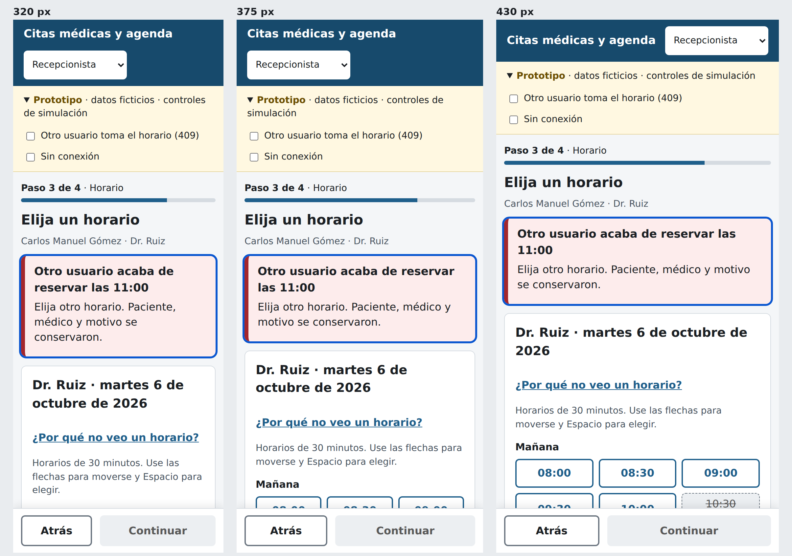
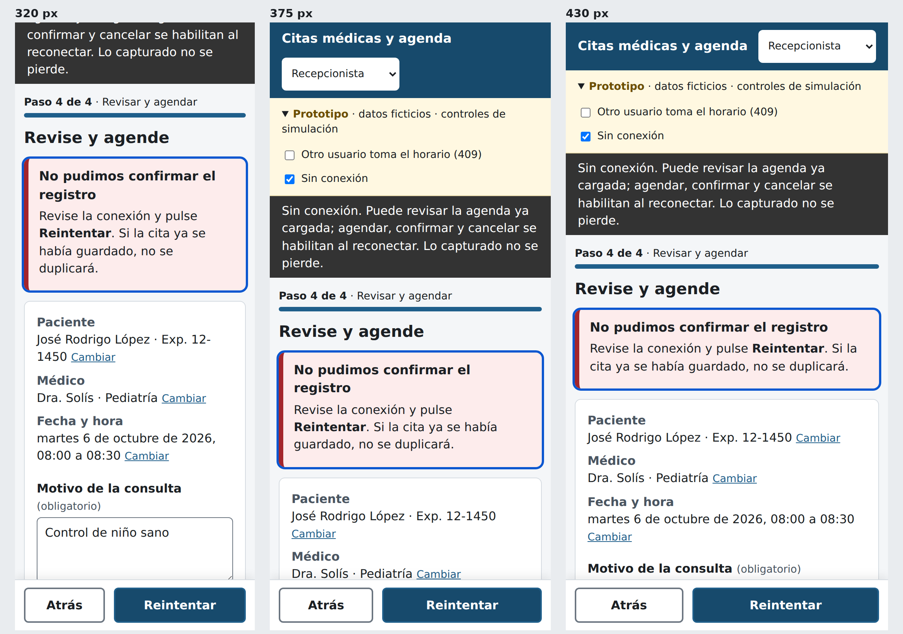

# Escenarios móviles — Semana 10

Dos escenarios reales del hospital en los que el teléfono cambia las
decisiones de contenido y de manejo de errores.

---

## Escenario 1 · Recepción en ventanilla con fila: el horario se lo gana otro usuario

**Contexto.** Sábado en consulta externa. La recepcionista atiende desde una
tableta pequeña o su teléfono porque la estación está ocupada. Hay fila, el
paciente está de pie frente a ella y otra recepcionista agenda para el mismo
médico al mismo tiempo.

**Qué pasa.** Elige las 11:00 para el Dr. Ruiz, escribe el motivo y pulsa
**Agendar cita**. Entre la consulta de horarios y el envío, la otra
recepcionista reservó las 11:00. El bloqueo por médico y día de la semana 6
impide la cita doble y el servidor rechaza la segunda solicitud: hoy con 422 y
un mensaje; con el `ErrorMapper` propuesto en la semana 7, con
`409 APPOINTMENT_SLOT_TAKEN`.

### Decisiones de contenido

| Decisión | Por qué |
|---|---|
| Regresar automáticamente al paso 3 con la grilla recargada | En móvil no hay espacio para mostrar el resumen y la grilla a la vez; lo útil es elegir otro horario |
| Alerta arriba de la grilla, con el horario perdido en el título: "Otro usuario acaba de reservar las 11:00" | Dice qué pasó y a qué hora sin leer el cuerpo; el título "Error" de la semana 8 no decía nada (H-04) |
| Segunda línea: "Elija otro horario. Paciente, médico y motivo se conservaron." | Con fila enfrente, la recepcionista necesita saber que no tiene que empezar de nuevo |
| La hora perdida queda marcada "Recién ocupado" en rojo claro | Evita que vuelva a buscarla y explica por qué desapareció |
| Foco a la alerta y `role="alert"` | Un lector de pantalla lo anuncia de inmediato |

### Decisiones de error

| Decisión | Por qué |
|---|---|
| No se muestra un aviso flotante | En 375 px taparía el indicador de progreso y desaparecería mientras atiende al paciente |
| No se reintenta automáticamente | Reintentar el mismo horario daría otro 409; la decisión de hora es del paciente |
| Se genera una nueva `Idempotency-Key` solo al cambiar de horario | La clave identifica una intención de cita concreta |

**Resultado verificable:** tras el 409 la pantalla está en el paso 3, la
alerta tiene el foco, la hora perdida figura como ocupada y al elegir otra y
continuar el motivo sigue escrito.

---

## Escenario 2 · Enfermería confirma desde el pasillo con cobertura débil

**Contexto.** La enfermera recorre el pasillo y confirma citas del día
siguiente por teléfono, apoyándose en su celular. El wifi del hospital se cae
entre pisos. Luego Recepción intenta agendar desde la misma zona.

### Decisiones de contenido

| Decisión | Por qué |
|---|---|
| Banner oscuro fijo: "Sin conexión. Puede revisar la agenda ya cargada; agendar, confirmar y cancelar se habilitan al reconectar. Lo capturado no se pierde." | Dice qué funciona, qué no y que no hay pérdida, en tres frases cortas |
| La agenda ya cargada sigue visible | La enfermera necesita ver a quién llamar aunque no pueda registrar |
| La lista de la enfermera abre en "Pendientes" | En móvil no hay espacio para citas que no requieren acción |
| No se guarda nada en el teléfono | El borrador tiene datos de paciente; se mantiene solo en memoria de la pestaña |

### Decisiones de error

| Decisión | Por qué |
|---|---|
| Al fallar el envío: "No pudimos confirmar el registro" (no "Error de red") | No se sabe si la solicitud llegó; decir "falló" podría provocar un duplicado manual |
| El botón cambia a **Reintentar** y reutiliza la misma `Idempotency-Key` | Si la primera solicitud sí llegó al servidor, el reintento devuelve esa cita y no crea otra |
| Todos los datos del formulario se conservan | Reescribir un motivo en teléfono es costoso |
| Confirmar/cancelar sin red muestran el error dentro del diálogo o en el detalle | La acción no se marca como hecha hasta que el servidor responde |

**Resultado verificable:** con la simulación "Sin conexión" activa, pulsar
**Agendar cita** muestra la alerta, el botón dice **Reintentar**, el motivo
sigue escrito y no aparece ninguna cita nueva en la agenda. Al quitar la
simulación y reintentar se crea exactamente una cita.
