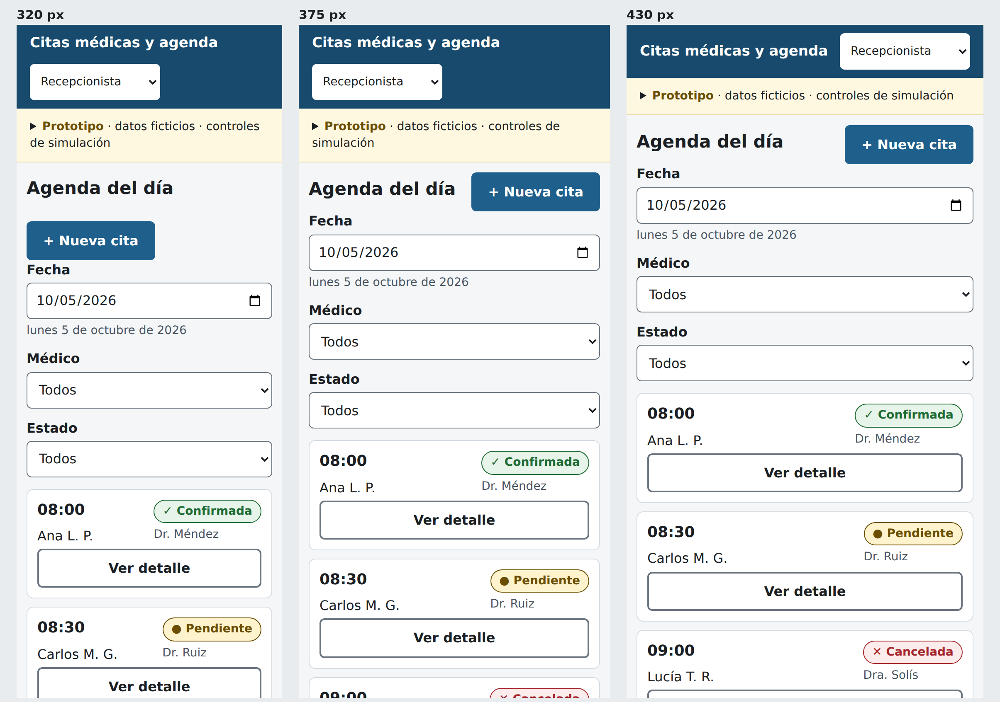
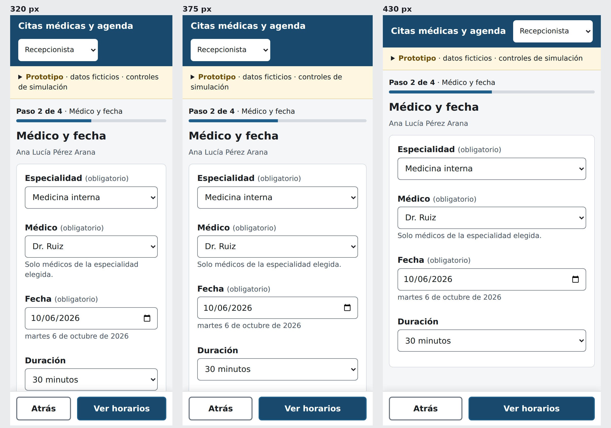
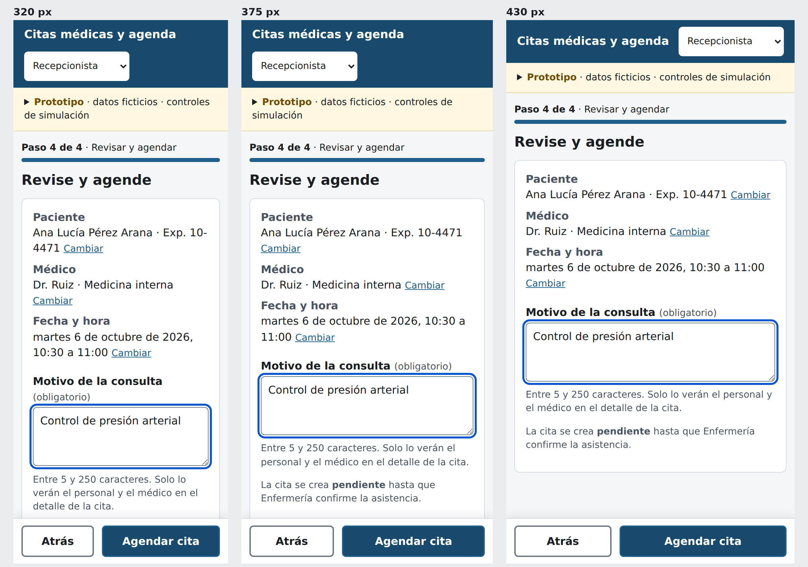
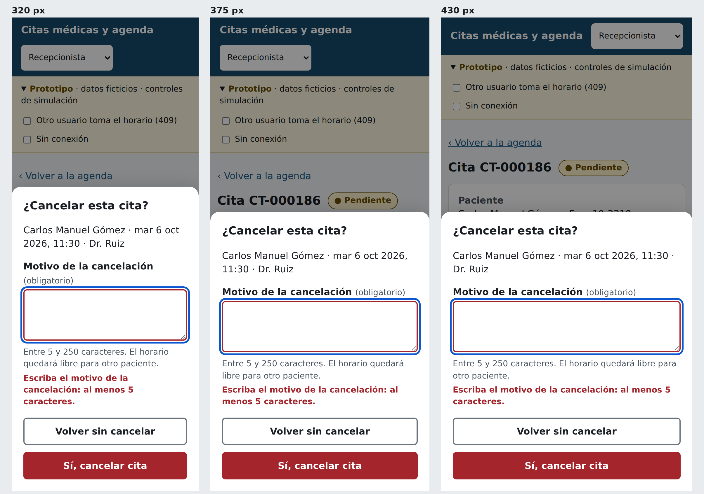

# Propuesta responsive — Semana 10

Adaptación del flujo **solicitud, validación de disponibilidad y confirmación
o cancelación de cita** a móvil (320–430 px). Cada pantalla se muestra a 320,
375 y 430 px en el mismo tablero.

Las pantallas son capturas del prototipo HTML (`prototipo/index.html`) que
se completa en la semana 11. Incorporan las correcciones **P1** del backlog de
la semana 9: H-01, H-03, H-04 y H-06.

## 1. Jerarquía de datos y acciones

En móvil cabe una decisión por pantalla. Se ordenó cada una así:

1. **Dónde estoy:** "Paso N de 4" + barra de progreso.
2. **Qué decido:** título en forma de pregunta o instrucción.
3. **Contexto mínimo:** una línea con lo ya elegido (paciente · médico · hora).
4. **Contenido de la decisión.**
5. **Acción principal:** barra fija inferior, al alcance del pulgar.

| Dato | Escritorio | Móvil | Motivo |
|---|---|---|---|
| Hora de la cita | Columna de tabla | Primer dato de la tarjeta, 18 px | Es lo que se busca en la agenda |
| Estado | Columna de tabla | Insignia arriba a la derecha | Visible sin abrir la cita |
| Paciente | Nombre abreviado | Nombre abreviado | Minimización de datos (semana 8) |
| Médico | Columna | Texto secundario | Menos relevante en la agenda filtrada |
| Motivo | Solo en detalle | Solo en detalle | Dato sensible |
| Indicador de pasos | 4 pestañas | "Paso N de 4" + barra | Cuatro pestañas no caben en 320 px |
| Controles del prototipo | Visibles | Plegados | No compiten con el contenido |

## 2. Pantallas

### P1 · Agenda del día

- La tabla se convierte en **lista de tarjetas**: una tabla de 5 columnas en
  320 px obliga a desplazarse en horizontal.
- Filtros apilados a ancho completo.
- Estado con texto + ícono + color (corrige H-01).
- "Ver detalle" como botón de 44 px de alto en cada tarjeta.

### P2 · Médico y fecha

- Una sola columna; cada campo a ancho completo.
- "(obligatorio)" en texto, no asterisco (anticipa H-08).
- Bajo la fecha se escribe el día en letras ("martes 6 de octubre de 2026"),
  porque el control nativo muestra el formato del sistema (anticipa H-07).
- Barra inferior fija: **Atrás** (1/3) y **Ver horarios** (2/3).

### P3 · Validación de disponibilidad

- La grilla pasa de 8 a **3 columnas** y se agrupa en **Mañana** y **Tarde**.
- Cada horario mide al menos 44 × 44 px.
- Ocupado: fondo gris, borde punteado, hora tachada y la palabra "Ocupado"
  (no depende del color).
- La grilla es un `radiogroup`: una parada de Tab y flechas para moverse
  (corrige H-03; también sirve con teclado Bluetooth en tabletas).
- La ayuda "¿Por qué no veo un horario?" es un botón con texto.

### P4 · Revisar y agendar

- El resumen pasa de dos columnas a etiqueta sobre valor.
- Cada dato tiene su enlace **Cambiar**, que regresa al paso correspondiente
  sin perder lo demás.
- La acción principal queda fija abajo y no la tapa el teclado del teléfono,
  porque el campo de motivo está sobre ella.

### P5 · Cancelar cita

- El diálogo se convierte en **hoja inferior** a ancho completo.
- Botones apilados: **Volver sin cancelar** arriba y **Sí, cancelar cita**
  abajo, en rojo. Ninguno dice solo "Cancelar" o "Aceptar" (corrige H-06).
- El error del motivo dice qué falta y cuánto.

## 3. Navegación

| Decisión | Aplicación |
|---|---|
| Sin menú lateral | El módulo tiene un solo flujo; la barra superior muestra módulo y rol |
| Atrás del navegador | Cada paso tiene su propia dirección (`#/nueva/1` … `#/nueva/4`), así que el botón atrás del teléfono regresa un paso y no sale del flujo |
| No saltar pasos | Si se abre `#/nueva/4` sin horario elegido, se redirige al primer paso incompleto |
| Foco al cambiar de pantalla | Pasa al título, para que el lector de pantalla anuncie dónde está |

## 4. Tablas y formularios

| Elemento | Regla en móvil |
|---|---|
| Tabla de agenda | Lista de tarjetas por debajo de 600 px |
| Resumen `dl` | Etiqueta arriba, valor abajo |
| Campos | Ancho completo, 44 px de alto, 16 px de letra (evita el zoom automático de iOS) |
| Tipos de teclado | `type="search"` para paciente, `type="date"` para fecha |
| Validación | Al salir del campo y al enviar; nunca mientras se escribe por primera vez |

## 5. Confirmaciones

| Acción | Confirmación |
|---|---|
| Agendar | Revisar todo en P4 antes del botón; éxito persistente con código |
| Confirmar asistencia | Hoja inferior con medio de contacto |
| Cancelar | Hoja inferior con los datos de la cita y motivo obligatorio |

## 6. Conexión limitada

| Situación | Comportamiento |
|---|---|
| Sin red al abrir | Banner oscuro fijo bajo la barra superior: qué se puede hacer y qué no |
| La agenda ya cargada | Se sigue viendo |
| Envío sin respuesta | "No pudimos confirmar el registro"; el botón pasa a **Reintentar** |
| Reintento | Reutiliza la misma `Idempotency-Key`: si la primera solicitud sí llegó, no se crea una segunda cita |
| Borrador | Se conserva en memoria mientras la pestaña esté abierta; no se guarda en el teléfono por contener datos de paciente |
| Carga lenta | Esqueleto de la grilla y `aria-busy`; nunca pantalla en blanco |

El detalle de estas decisiones está en
[`escenarios-moviles.md`](escenarios-moviles.md).
