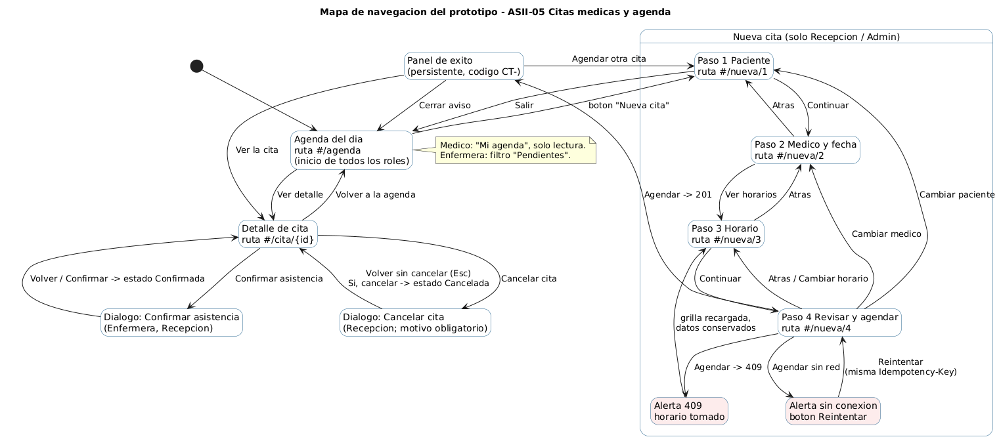
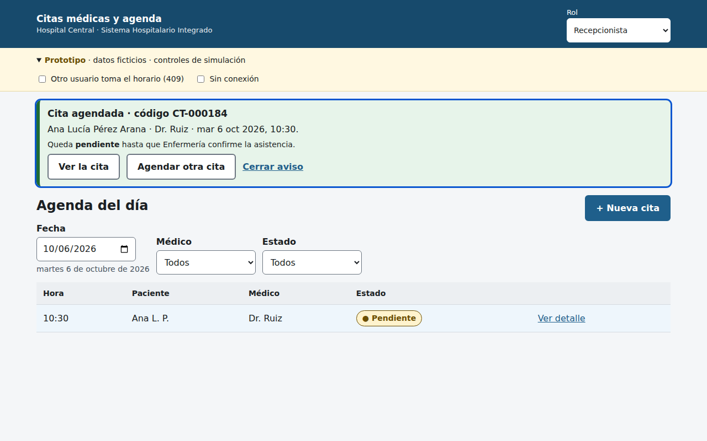
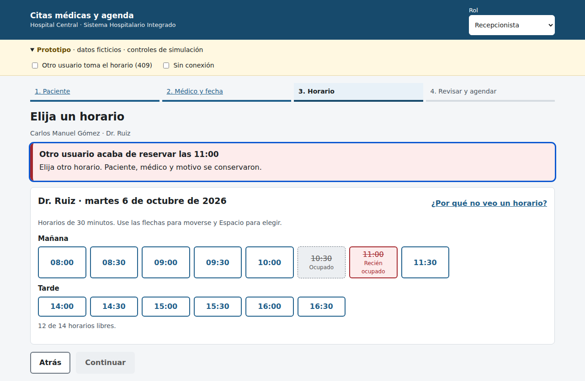

# Semana 11 — Mejores prácticas para diseño móvil/web

Módulo **ASII-05 — Citas médicas y agenda**.

| Dato | Información |
|---|---|
| Estudiante | Eddy Adolfo Castro Véliz |
| Código | 1890-23-16857 |
| GitHub | EddCastro |
| Correo | ecastrov5@miumg.edu.gt |
| Rama | `feature/week-11-prototipo` |

## Tarea

Construir un prototipo navegable desktop y móvil del flujo principal, que
cubra el camino feliz y un error crítico relacionado con citas, agenda médica,
disponibilidad, confirmación, cancelación y concurrencia, manteniendo
consistencia de roles, estados y accesibilidad.

## Prototipo

| Forma de abrirlo | Enlace |
|---|---|
| En línea (GitHub Pages) | https://eddcastro.github.io/micro-his-citas-medicas-agenda/prototipo/ |
| Archivo | [`prototipo/index.html`](../../prototipo/index.html) — un solo archivo, sin dependencias; se abre con doble clic |

Es HTML, CSS y JavaScript sin librerías. Los datos son ficticios y viven en
memoria: al recargar la página se reinician.

### Cómo recorrerlo

1. **Camino feliz (Recepcionista):** *+ Nueva cita* → buscar "Pérez" → Medicina
   interna, Dr. Ruiz → elegir un horario → escribir el motivo → *Agendar cita*.
2. **Error crítico (concurrencia):** repetir el flujo y, antes de pulsar
   *Agendar cita*, marcar **"Otro usuario toma el horario (409)"** en la franja
   amarilla de controles del prototipo.
3. **Sin conexión:** marcar **"Sin conexión"** y agendar.
4. **Roles:** cambiar el selector *Rol* a Enfermera o Médico.
5. **Móvil:** abrirlo en el teléfono o reducir la ventana por debajo de 600 px.

## Entregables

| Evidencia pedida | Archivo |
|---|---|
| Enlace o archivo del prototipo | Ver la tabla anterior |
| Mapa de navegación | [`mapa-navegacion.png`](mapa-navegacion.png) — fuente `.puml` |
| Capturas desktop y móvil del camino feliz | [`capturas/`](capturas) — pasos 01 a 07 |
| Capturas desktop y móvil del error crítico | [`capturas/`](capturas) — pasos 08 a 10 |
| Consistencia de roles, estados y accesibilidad | [`verificacion.md`](verificacion.md) |
| Declaración de IA | [`DECLARACION_IA.md`](DECLARACION_IA.md) |

## Mapa de navegación



Cada pantalla tiene su propia dirección (`#/agenda`, `#/nueva/1` a
`#/nueva/4`, `#/cita/{id}`), así que el botón atrás del navegador y del
teléfono funcionan como se espera.

## Camino feliz

| Paso | Escritorio | Móvil |
|---|---|---|
| 1. Agenda del día | [desktop-01](capturas/desktop-01-agenda.png) | [movil-01](capturas/movil-01-agenda.png) |
| 2. Paciente | [desktop-02](capturas/desktop-02-paciente.png) | [movil-02](capturas/movil-02-paciente.png) |
| 3. Médico y fecha | [desktop-03](capturas/desktop-03-medico-fecha.png) | [movil-03](capturas/movil-03-medico-fecha.png) |
| 4. Horarios cargando | [desktop-04](capturas/desktop-04-horarios-cargando.png) | [movil-04](capturas/movil-04-horarios-cargando.png) |
| 5. Horario elegido | [desktop-05](capturas/desktop-05-horario-elegido.png) | [movil-05](capturas/movil-05-horario-elegido.png) |
| 6. Revisar y agendar | [desktop-06](capturas/desktop-06-revisar.png) | [movil-06](capturas/movil-06-revisar.png) |
| 7. Éxito | [desktop-07](capturas/desktop-07-exito.png) | [movil-07](capturas/movil-07-exito.png) |



## Error crítico: otro usuario toma el horario (409)

Es el error más grave del módulo porque, sin control, termina en dos citas del
mismo médico a la misma hora. En el backend lo impiden el bloqueo por médico y
día y el índice único parcial de la semana 6; el prototipo muestra cómo lo vive
el usuario.

| Paso | Escritorio | Móvil |
|---|---|---|
| 8. Antes de agendar | [desktop-08](capturas/desktop-08-antes-del-conflicto.png) | [movil-08](capturas/movil-08-antes-del-conflicto.png) |
| 9. Conflicto 409 | [desktop-09](capturas/desktop-09-error-409-horario-tomado.png) | [movil-09](capturas/movil-09-error-409-horario-tomado.png) |
| 10. Recuperado con otro horario | [desktop-10](capturas/desktop-10-recuperado-exito.png) | [movil-10](capturas/movil-10-recuperado-exito.png) |



| Qué hace la interfaz | Por qué |
|---|---|
| Regresa al paso 3 con la grilla recargada | El usuario necesita otro horario, no otra vez el resumen |
| Título "Otro usuario acaba de reservar las 11:00" | Dice qué pasó y cuál horario se perdió |
| El horario queda "Recién ocupado" | Explica por qué ya no está libre |
| Paciente, médico y motivo se conservan | No se castiga al usuario por un conflicto que no causó |
| Foco a la alerta con `role="alert"` | Lo anuncia un lector de pantalla |

## Otras capturas

Detalle de cita (11), validación del motivo de cancelación (12), cita
cancelada (13), sin conexión (14) y vista de la Enfermera (15), en ambos
tamaños.

## Reproducir capturas y verificación

```powershell
pip install playwright pillow
python -m playwright install chromium
npm install axe-core
python prototipo/pruebas/recorrido.py todo
python prototipo/pruebas/verificar.py
```

## Datos

Pacientes, médicos y códigos de cita son ficticios.
